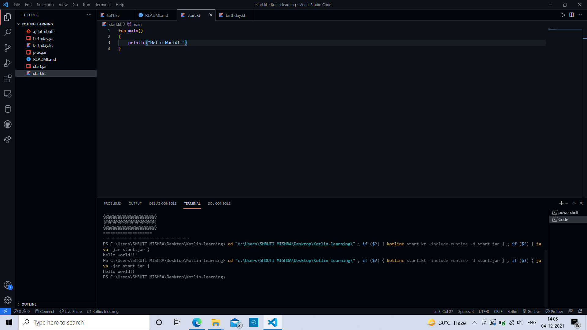
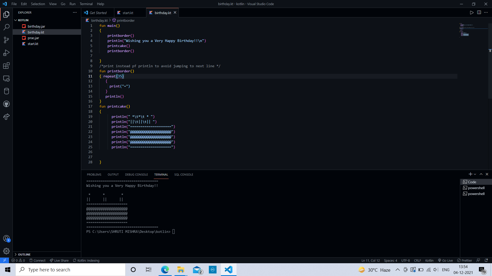

## Kotlin Learning
<h2> About this project : </h2>
  

1.Starting with kotlin. 
2.Creating a birthday wishing program.

  

## 📌 Tech Stack:
  
[]
[]
  

## 📌 Main Page:
  
<h4>HELLO WORLD</h4>

  
<!--
  -->
<h4>BIRTHDAY WISHING PROGRAM</h4>

  
<!--
  
<h4>BUTTON SECTION</h4>

  

  

  
<h4>DETAILS FORM WINDOW</h4>

  

  -->

<h2>📌 Contact :</h2>
  

<a href="mailto:shrutidmishra2002@gmail.com">

 

© 2021 Shruti Mishra 
